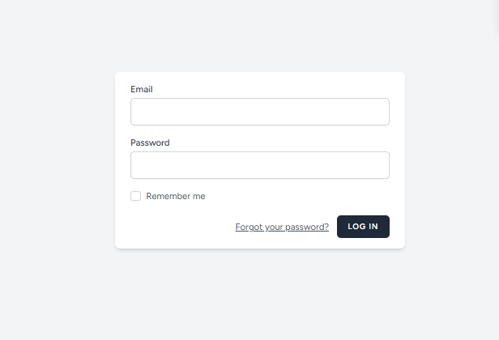
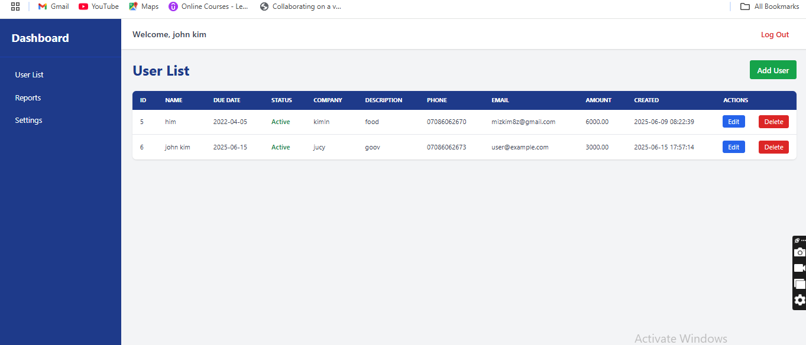

# 🚀 New Project – Laravel Full-Stack App

A professional full-stack web application built with **Laravel**, **Blade**, **Tailwind CSS**, and modern best practices.  
Perfect for showcasing authentication, responsive design, and CRUD operations.

  

## ✨ Features

- 🛡️ Secure User Authentication (Laravel Breeze)
- 📋 Full CRUD operations
- 🎨 Responsive UI with Tailwind CSS
- 🧩 Modular code structure
- 🔍 Search & filtering system
- 🗃️ RESTful routing and controllers

---

## 📸 Screenshots

> _Preview the UI_

| Login Page | Dashboard |
|------------|-----------|
|  |  |

---

## 🛠️ Tech Stack

| Layer        | Technology            |
|-------------|------------------------|
| Backend     | PHP 8.x, Laravel 10    |
| Frontend    | Blade, Tailwind CSS    |
| Auth        | Laravel Breeze         |
| Database    | MySQL                  |
| Dev Tools   | Laravel Mix, Artisan   |

---

## 🚀 Getting Started

### 1. Clone the Repository

composer install
npm install && npm run dev
cp .env.example .env
php artisan key:generate
php artisan migrate --seed
php artisan serve

new-project/
├── app/               # Core application logic
├── resources/views/   # Blade templates
├── public/            # Public assets
├── routes/web.php     # Route definitions
├── database/          # Migrations and seeders

php artisan test

🌍 Live Demo (Optional)
If deployed, add your link here.

🔗 Live Demo

📜 License
This project is licensed under the MIT License.
See the LICENSE file for more info.

🙋 About Me
👤 [Your Name]
📧 Email: your@email.com
🔗 Portfolio Website | LinkedIn | GitHub

## License

The Laravel framework is open-sourced software licensed under the [MIT license](https://opensource.org/licenses/MIT).
